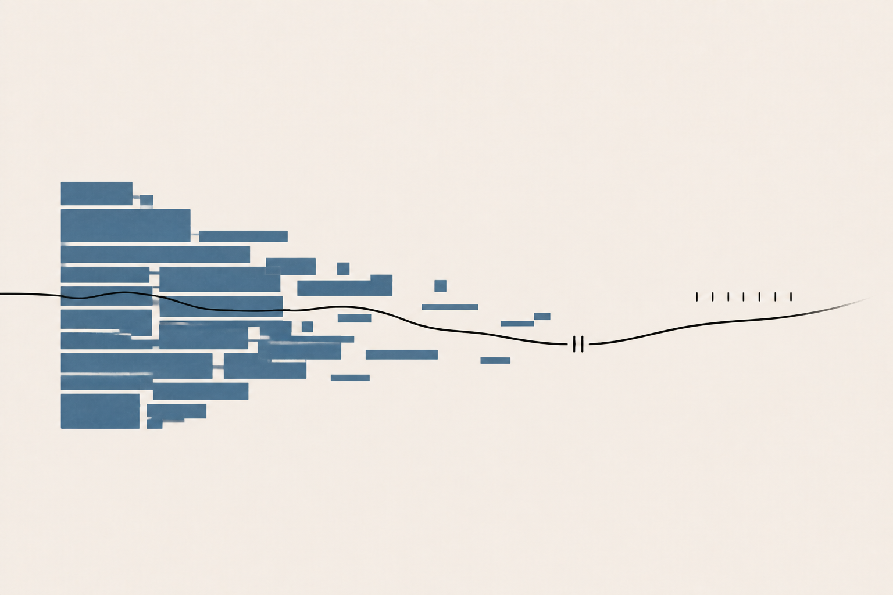
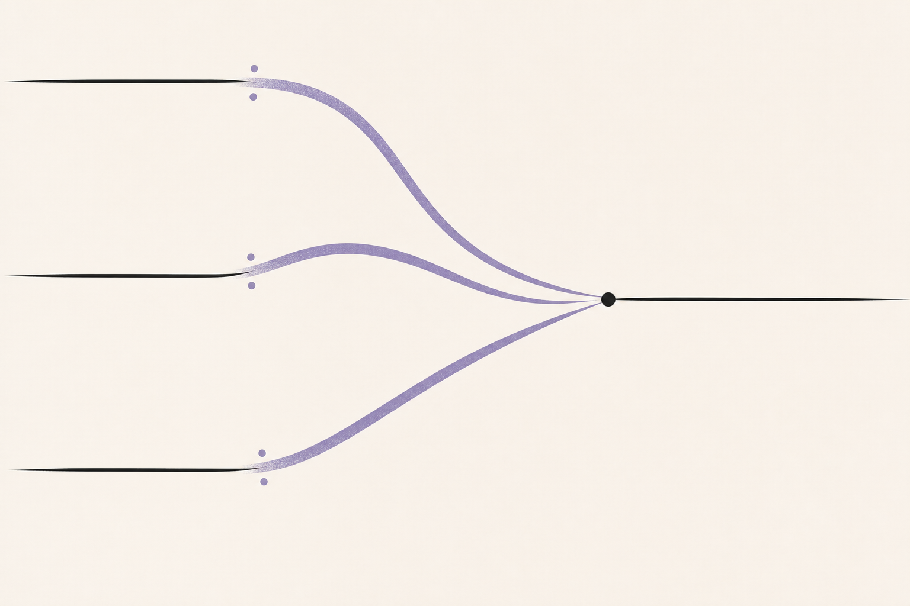
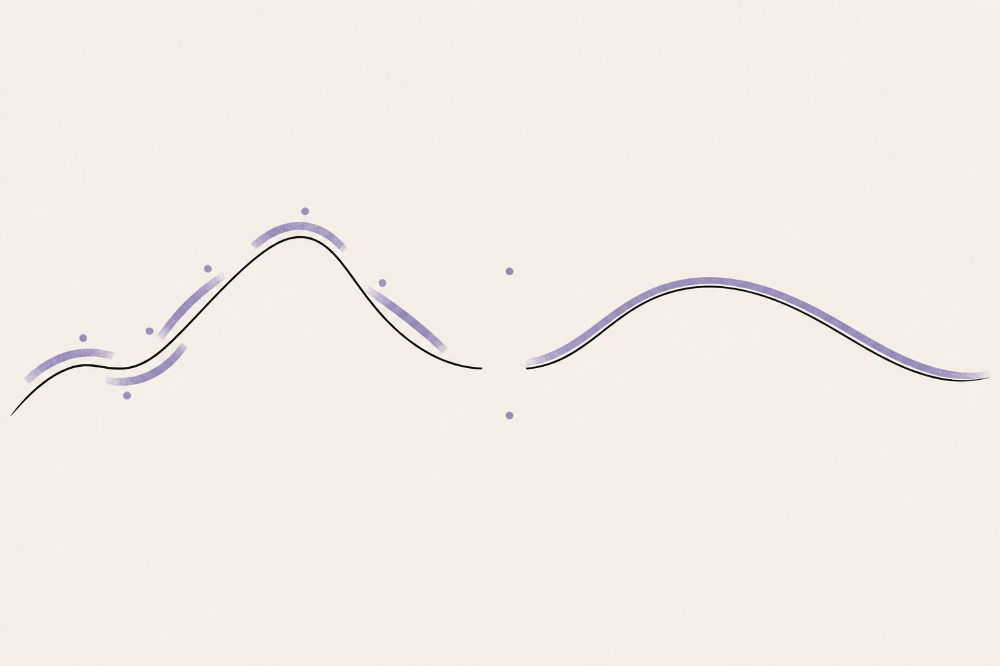
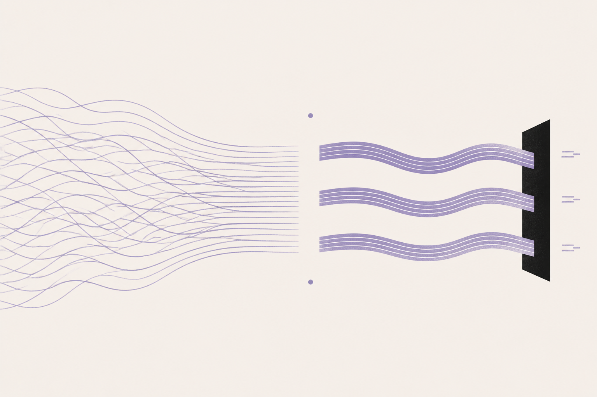

# Semantic Field Editorial

`semantic-field-editorial` 将文章、章节、随笔、博客、公众号长文或报告转化为一套具有统一视觉语言的原创编辑插图。它关注文章内部的关系、运动、张力与转折，而不是把段落逐句画成流程图、名词拼贴或素材图。

> 本 README 面向使用者，解释技能的默认行为、可调参数、协作方式与真实案例。技能运行时仍以 [`SKILL.md`](SKILL.md) 和 `references/` 中的规范为准；README 不会被自动加载，不增加日常调用的上下文开销。

## 目录

- [快速开始](#快速开始)
- [默认工作流程](#默认工作流程)
- [默认图像配置](#默认图像配置)
- [默认视觉语言](#默认视觉语言)
- [渲染器选择](#渲染器选择)
- [用户如何参与](#用户如何参与)
- [在网页版 ChatGPT 中手动使用提示词](#在网页版-chatgpt-中手动使用提示词)
- [可调参数速查](#可调参数速查)
- [如何提出修改](#如何提出修改)
- [交付与文件组织](#交付与文件组织)
- [边界与注意事项](#边界与注意事项)
- [实际使用案例](#实际使用案例)
- [致谢](#致谢)

## 快速开始

最简单的调用方式只需要提供完整文章和目标：

```text
使用 $semantic-field-editorial 为「文章.md」生成题图和插图，
汇总到同名文件夹中。
```

在没有额外约束时，技能会自行完成：

1. 通读全文，而不是看到第一个标题就开始作画。
2. 提炼核心命题、重要关系、论证转折和情绪温度。
3. 只选择真正值得插图的位置。
4. 为整篇文章建立统一 Visual DNA。
5. 为每张图指定一个明确工作。
6. 选择栅格生成或 SVG。
7. 生成、检查、按最小变量修订并保存实际文件。

如果希望先参与决策，可以直接说：

```text
先不要生成。请先给出候选插图点、每张图的工作、比例和 Visual DNA，
等我确认后再开始出图。
```

## 默认工作流程

技能遵循以下顺序：

```text
READ
→ DISTILL
→ MAP RELATIONS
→ SELECT ILLUSTRATION POINTS
→ BUILD VISUAL DNA
→ ASSIGN JOBS
→ COMPOSE
→ RENDER
→ VERIFY
```

### 1. 阅读与提炼

默认从“操作”而不是“名词”开始理解文章。例如，不停留在“模型、公司、用户、资本”，而是提炼为：

```text
中心化 → 扩散 → 反馈 → 重新汇聚
```

这些操作关系会决定画面中的方向、尺度、密度、断裂、回环和留白。

### 2. 选择插图点

技能不会机械地为每一节配图。优先选择：

- 概念最核心的段落；
- 关系复杂、难以想象的机制；
- 文章的重要转折；
- 连续密集文字中需要视觉呼吸的位置；
- 能形成独立视觉命题、且不会与其他图重复的位置。

简单定义、短列表、重复论点和过渡段通常会被跳过。

### 3. 建立 Visual DNA

当图像数量大于 1 时，默认生成并验证 `visual-dna.json`。同一篇文章的图片共享：

- 背景与结构墨色；
- 主强调色；
- Anchor、Trace、Echo 的标记家族；
- Void 的空缺行为；
- 纹理强度；
- 默认信息密度；
- 一个反复出现的微型母题。

不同图片会改变构图、方向、尺度和留白位置，而不是突然更换整套风格。

## 默认图像配置

对于一篇篇幅较长、结构完整的文章，默认配置是：

```text
1 × Header / Hero
1–2 × Chapter Summary 或 Explanatory
0–1 × Atmospheric Interlude（确有需要时）
```

这是选择起点，不是固定配额。短文可能只需要 1 张题图；概念密集的技术文章可能需要 3–4 张；如果某些章节没有独立视觉价值，技能会主动减少数量。

| 图像工作 | 默认用途 | 语义距离 | 默认比例 | SVG 默认画布 | 默认文字量 |
| --- | --- | ---: | --- | --- | --- |
| Header / Hero | 表达全文的视觉命题，不负责总结全部章节 | 3 / 5 | 2:1 | 1600×800 | 通常无文字，必要时最多 0–6 个词 |
| Chapter Summary | 将一个章节压缩为一个视觉命题 | 2.5 / 5 | 3:2 或 16:10 | 1440×960 | 仅在有助理解时使用短标签 |
| Explanatory | 解释机制、因果、比较、变换或技术关系 | 1–2 / 5 | 4:3 或 3:2 | 1440×960 | 仅保留必要标签、数字或公式 |
| Atmospheric | 承载情绪、哲学压力或阅读停顿 | 4 / 5 | 3:2 | 1440×960 | 默认无文字 |

### 比例与像素尺寸的区别

- **比例是首要约束。** 未指定平台时，题图默认 2:1，正文图通常为 3:2。
- **栅格图采用生成器支持的原生尺寸。** 例如 2:1 成图可能是 1774×887，3:2 成图可能是 1536×1024；只要比例准确且清晰，就不强制重采样到某个整数尺寸。
- **SVG 使用确定画布。** 默认题图 1600×800，正文图 1440×960，适合需要精确尺寸、标签或后续编辑的场景。
- **平台要求优先。** 用户指定公众号、博客主题、社交媒体卡片或仓库裁切规范时，平台比例和安全区覆盖上述默认值。

## 默认视觉语言

### 核心签名

每张图通常自然包含以下四种角色中的至少三种：

> **ONE ANCHOR + ONE TRACE + ONE VOID + ONE ECHO**

| 角色 | 作用 | 常见形式 |
| --- | --- | --- |
| Anchor / 锚点 | 承载画面最重要的语义质量 | 切口圆盘、厚重平面、层叠色带、阶梯场、柔和几何质量 |
| Trace / 轨迹 | 表达时间、因果、转换、递归或论证路径 | 线、弧、轴、回环、切割、漂移路径 |
| Void / 空缺 | 表达未知、边界、停顿、差异或未完成状态 | 开口、狭缝、缺角、断线、大面积负空间 |
| Echo / 回声 | 表达迭代、积累、反馈、群体或余波 | 短条、节点、点阵、台阶、逐渐变稀的重复 |

它们是构图角色，不是四栏模板，也不会在图片中写成标签。

### 默认配色

基础颜色：

```text
Background  #F3EFE7  暖象牙
Ink         #1E1E1B  柔和近黑
```

强调色库：

| 名称 | 色值 | 常见语义温度 |
| --- | --- | --- |
| Ember | `#D56845` | 能量、摩擦、行动、断裂、紧迫 |
| Mineral | `#5F7686` | 分析、系统、距离、理性、基础设施 |
| Moss | `#6F7B63` | 生长、连续、生态、耐心、缓慢变化 |
| Violet | `#8879A8` | 抽象、意识、推测、复杂性、暧昧 |
| Ochre | `#C39A4B` | 历史、工艺、物质、积累、时间沉积 |

默认每张图只使用一个完整强调色，可以使用它的浅色衍生色。只有文章存在真实且重要的二元对立时，才加入第二个完整强调色。

### 默认构图

- 保持约 55%–75% 的视觉安静区域；
- 不超过三个主要视觉组；
- 优先使用非对称平衡；
- 避免平均分布和自动布局感；
- 让负空间承担意义，而不是只做空背景；
- 将核心内容放在安全裁切区域；
- 允许极远距离或近距离张力，但必须来自文章关系。

### 默认纹理与线条

纹理只出现在少量主体内部，常用轻微干式丝网颗粒、稀疏点描、短排线或略不完美的颜料边缘。背景默认保持平整安静，不使用整页旧纸纹理、大面积噪点、发光、雾化或强渐变。

### 默认文字策略

- 题图通常不嵌标题；
- 概要图只在必要时使用极短标签；
- 解释图可以包含精确标签、数字或公式；
- 氛围图默认完全无文字；
- 不生成无意义英文、假引用、虚构统计、随机公式或装饰性微文案。

### 默认风格边界

技能默认避免发光大脑、机器人头、灯泡、齿轮、拼图、素材网站图标、随机神经网络、玻璃拟态、蓝紫霓虹、假 Dashboard、PPT 卡片和无来源的科技装饰。

## 渲染器选择

技能不会对所有图片强制使用同一种渲染方式。

### 默认使用栅格生成

适合：

- 题图与封面；
- 氛围插图；
- 表达性章节概要；
- 依赖颜料边缘、材质和细微几何张力的作品。

### 默认使用 SVG

适合：

- 关系必须精确的解释图；
- 数学、逻辑或技术结构；
- 必须正确显示的标签、数字与公式；
- 需要确定布局、精确画布或后续编辑的图。

如果栅格图中的文字错误或机制关系仍然含混，技能会优先切换到 SVG，而不是反复要求生成模型碰运气。

## 用户如何参与

所有默认值都可以被自然语言覆盖。用户可以选择三种协作深度。

### 模式 A：自动完成

适合希望直接得到成品的用户。

```text
使用 $semantic-field-editorial 为这篇文章生成题图和插图。
数量、位置、比例和风格由你根据文章决定。
```

技能会自行选择插图点、建立 Visual DNA、生成、检查并交付。

### 模式 B：先审方案，再生成

适合希望参与方向但不想逐张设计的用户。

```text
先通读文章并给我：
1. 候选插图点；
2. 每张图的工作和语义距离；
3. 推荐比例；
4. Visual DNA。
先不要生成，等我确认。
```

用户确认后，可以要求先生成题图。题图获批后，后续图片会把它作为视觉参考，以提高系列一致性。

### 模式 C：明确艺术指导

适合已有版式、品牌色或视觉偏好的用户。

```text
生成 1 张 2:1 题图和 2 张 3:2 正文图。
主强调色使用 Moss #6F7B63，整体更安静，留白不少于 70%。
题图语义距离 3.5，不出现人物和文字。
解释图必须使用 SVG，并保留可编辑标签。
每张图生成前先告诉我它的构图命题。
```

## 在网页版 ChatGPT 中手动使用提示词

不安装 Skill 也可以在网页版 ChatGPT 中复现这套工作方式。核心流程是：

1. 根据文章语言选择中文或英文独立提示词。
2. 在同一会话中提供完整文章或上传文章文件。
3. 附加 `[REQUEST]`，声明图像工作、数量、比例、平台、必须保留内容和排除项。
4. 需要参与方向时，先要求输出插图计划与 Visual DNA，暂不生成。
5. 先生成题图；批准后，把它作为风格参考逐张生成正文图。
6. 修改时一次只调整一个变量，并明确其余不变。

独立提示词与完整手动流程集中在：

- **[`references/prompt-usage.md`](references/prompt-usage.md)**：网页版 ChatGPT 操作顺序、粘贴文章与上传附件两种方式、多图续作、参考图用法、差量修改和常见问题。
- [`references/semantic-field-editorial-prompt.zh-CN.md`](references/semantic-field-editorial-prompt.zh-CN.md)：中文独立提示词。
- [`references/semantic-field-editorial-prompt.en.md`](references/semantic-field-editorial-prompt.en.md)：英文独立提示词。

最短请求外壳：

```text
[DOCUMENT]
# 文章标题
粘贴完整文章。
[/DOCUMENT]

[REQUEST]
type: auto
count: auto
platform: blog
language: zh-CN
avoid:
- 人物
- 嵌入文字
[/REQUEST]

先完整阅读全文，输出插图计划、比例和统一 Visual DNA，暂不生成。
```

ChatGPT 当前支持对话式创建和编辑图片、上传参考图片，以及通过提示或界面指定宽高比。操作入口与支持范围以 [OpenAI 官方 ChatGPT 图像说明](https://help.openai.com/zh-hans-cn/articles/11084440-chatgpt-images-%E5%B8%B8%E8%A7%81%E9%97%AE%E9%A2%98%E8%A7%A3%E7%AD%94) 和 [Image Inputs FAQ](https://help.openai.com/en/articles/8400551-image-inputs-for-chatgpt-faq) 为准。

## 可调参数速查

| 参数 | 默认行为 | 用户可以怎样调整 |
| --- | --- | --- |
| 数量 | 长文通常 2–4 张，按视觉价值选择 | “只要 1 张题图”“正文再加 2 张”“最多 3 张” |
| 图像工作 | 自动分配 Header、Summary、Explanatory、Atmosphere | “第二张必须解释反馈机制”“不要氛围图” |
| 语义距离 | 题图 3、概要 2.5、解释 1–2、氛围 4 | “整体更抽象一级”“解释图降到 1.5” |
| 比例 | 题图 2:1，正文常用 3:2 | “公众号头图 2.35:1”“全部使用 16:10” |
| 像素尺寸 | 栅格采用工具原生尺寸，SVG 使用默认画布 | “输出 1600×800 SVG”“最终裁成 1200×630” |
| 平台 | 无指定时按通用文章插图处理 | “面向微信公众号”“用于博客暗色主题” |
| 配色 | 暖象牙、近黑、一个语义相关强调色 | “改用 Ember”“保持黑白”“加入第二色表达对立” |
| 留白 | 55%–75% 安静区 | “更紧凑”“留白至少 70%”“右侧留出标题区” |
| 信息密度 | 默认低到中，最多三个视觉组 | “减少回声节点”“增加一层结构，但不要标签” |
| 标记家族 | 根据文章选择圆环、平面、色带、阶梯等 | “保留圆环家族”“把阶梯改为层叠色带” |
| 文字 | 尽量不嵌字 | “完全无字”“只保留两个标签”“标题不要入图” |
| 纹理 | 只在主体内使用轻微颗粒 | “完全平涂”“颗粒更弱”“保留颜料边缘” |
| 裁切安全 | 主体默认放在安全区 | “移动端中央裁切优先”“左侧预留封面文字” |
| 渲染器 | 表达性图用栅格，精确图用 SVG | “全部输出 SVG”“题图栅格、机制图 SVG” |
| 系列一致性 | 多图共享 Visual DNA | “沿用第一张风格”“第三张允许更高密度” |
| 排除项 | 默认执行 Anti-slop 约束 | “不要人物、设备、坐标轴、箭头和文字” |

## 如何提出修改

技能默认使用“按差量修改”的方式：只改用户指出的变量，保留其他已经通过的 Visual DNA 与构图关系。

### 常用调整语言

| 用户表达 | 技能通常如何解释 |
| --- | --- |
| “更抽象” | 语义距离提高约一级，减少直接映射，保留核心关系 |
| “更清晰” | 先降低语义距离，再考虑增加少量文字 |
| “更安静” | 增加留白，减少 Echo 和纹理，降低局部密度 |
| “更有张力” | 增加偏轴、近距离冲突或压缩的负空间 |
| “更像解释图” | 关系几何更精确，必要时切换 SVG |
| “不要像信息图” | 删除标签、卡片、流程框和一对一名词映射 |
| “保持系列一致” | 固定背景、墨色、强调色、标记家族和微型母题 |

### 推荐的单变量修改

```text
保持 Visual DNA 和构图不变，只把语义距离从 2 提高到 3。
```

```text
只增加右侧留白，用于移动端裁切；主体和颜色不变。
```

```text
保留 Anchor 与 Void，把 Trace 从回环改成单向漂移，
因为原文描述的是不可逆变化而不是反馈。
```

```text
删除所有嵌入文字，其他内容不变。
```

当一张图已经被批准时，最好明确说“只改什么”和“什么必须保持不变”，这样可以减少风格漂移。

## 交付与文件组织

默认使用稳定、可读的文件名：

```text
article-slug--hero.png
article-slug--section-02-summary.png
article-slug--mechanism.svg
article-slug--atmosphere.png
```

多图项目通常包含：

```text
article-name/
├── article-slug--hero.png
├── article-slug--section-summary.png
├── article-slug--mechanism.svg
├── visual-dna.json
├── prompts.md
├── contact-sheet.png
└── README.md 或说明文件（按用户要求）
```

交付时会尽量给出：

- 图像工作；
- 来源段落或推荐插入位置；
- 实际文件；
- 比例与尺寸；
- 替代文本；
- 生成提示词与 Visual DNA；
- 批量联系表（多图时）。

如果用户只要求生成附件，技能不会自动修改原文章。若希望直接集成，请明确提出：

```text
生成后把图片链接插入 Markdown 的推荐位置，并保持原文其他内容不变。
```

## 边界与注意事项

- 文章是语义事实来源；插图可以创造隐喻，但不能创造新的事实主张。
- 原文只表达相关性时，不会擅自画成因果关系。
- 原文存在不确定性时，不会画成确定结论。
- 不虚构数据、统计、年份、公式或技术对象。
- 栅格生成中的精确文字需要人工检查；文字重要时优先使用 SVG。
- 生成模型可能采用原生像素尺寸，因此应把“比例”和“像素尺寸”分别说明。
- 多图一致性需要视觉参考；通常先批准题图，再让后续图引用它或联系表。
- 案例只展示输出与生成附件，不在技能包中复制原始文章正文。

## 实际使用案例

以下案例展示同一套默认规则如何适应不同内容。案例附件位于 `examples/`，不是技能运行依赖。

### 案例一：How People Learn

原文：[译 - How People Learning](https://github.com/lartpang/blog/blob/main/content/%E8%AF%91%20-%20How%20People%20Learning.md)

文章从元认知、自我调节和既定范例三个角度讨论学习。系列没有逐项绘制教学工具，而是把共同结构提炼为：

```text
观察自身学习 → 校正方向 → 支撑逐步淡出 → 独立行动
```

配置：1 张题图、2 张章节概要、1 张解释性插图；主强调色为 Mineral `#5F7686`。

<p align="center">
  
</p>

<table>
  <tr>
    <td width="33%"></td>
    <td width="33%"></td>
    <td width="33%"></td>
  </tr>
  <tr>
    <td align="center">元认知：判断与校准</td>
    <td align="center">自我调节：持续修正</td>
    <td align="center">既定范例：支撑淡出</td>
  </tr>
</table>

案例附件：[联系表](examples/how-people-learn/contact-sheet.png) · [Visual DNA](examples/how-people-learn/visual-dna.json) · [生成提示词](examples/how-people-learn/prompts.md)

### 案例二：从线性结构到可学习非线性

原文：[神经网络：从线性结构到可学习非线性](https://blog.csdn.net/P_LarT/article/details/155709559)

文章比较 ONN、Self-ONN、KAN、KAT、rKAN、RAN 与 FC-KAN 等路线。系列没有把模型名称做成架构拼贴，而是抓住贯穿全文的结构变化：

```text
同质线性传递 → 边上可学习函数 → 函数基与交互结构分化 → 规模化时重新分组
```

配置：1 张题图、2 张章节概要、1 张解释性插图；主强调色为 Violet `#8879A8`。

<p align="center">
  
</p>

<table>
  <tr>
    <td width="33%"></td>
    <td width="33%"></td>
    <td width="33%"></td>
  </tr>
  <tr>
    <td align="center">边函数：非线性位置迁移</td>
    <td align="center">函数基：局部与全局</td>
    <td align="center">规模化：异质性与共享</td>
  </tr>
</table>

案例附件：[联系表](examples/learnable-nonlinearity/contact-sheet.png) · [Visual DNA](examples/learnable-nonlinearity/visual-dna.json) · [生成提示词](examples/learnable-nonlinearity/prompts.md)

## 相关文件

- 运行流程：[`SKILL.md`](SKILL.md)
- 视觉语言：[`references/visual-language.md`](references/visual-language.md)
- 渲染与 QA：[`references/rendering-and-qa.md`](references/rendering-and-qa.md)
- Visual DNA schema：[`references/visual-dna.schema.json`](references/visual-dna.schema.json)
- 独立提示词用法：[`references/prompt-usage.md`](references/prompt-usage.md)
